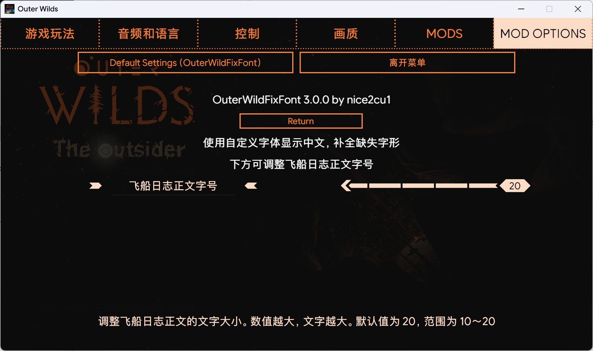

# OuterWildFixFont

[中文说明](#中文说明) | [English Overview](#english-overview)

## 中文说明

为《星际拓荒》（Outer Wilds）的简体中文界面及剧情 MOD 提供字体替换，改善中文缺字问题。覆盖角色对话、挪麦翻译器、飞船日志等界面；实际可显示的字符取决于所用字体的字形覆盖范围。

项目最初为 [The Outsider](https://github.com/StreetlightsBehindTheTrees/Outer-Wilds-The-Outsider) 的中文翻译需求而创建，也可用于其他剧情 MOD。

## 安装与使用

推荐使用 [**Outer Wilds Mod Manager**](https://outerwildsmods.com/mod-manager/) 安装和管理本 MOD。

将发布包解压到 OWML 的 MOD 目录，使 `manifest.json` 位于该 MOD 文件夹的根目录。安装后的主要文件如下：

```text
nice2cu1.OuterWildFixFont/
├── OuterWildFixFont.dll
├── manifest.json
├── default-config.json
├── LICENSE
└── Fonts/
    └── GameFont.ttf
```

在游戏中使用简体中文，并启用本 MOD。在 MOD 配置菜单中可以调整“飞船日志正文字号”，默认 **20**，范围 **10～20**。已有用户配置会保留原来的设置；需要时可手动调整或恢复默认设置。



## 替换字体

将需要使用的 TTF 字体放入 MOD 文件夹的 `Fonts/` 目录，并命名为 `GameFont.ttf`，然后重启游戏。字体应包含所需的中文字符。

MOD 启动时读取这个文件，无需手动制作字体 AssetBundle。字体加载失败时，可在 OWML 日志中查看原因。

## English Overview

OuterWildFixFont replaces fonts in the Simplified Chinese interfaces of **Outer Wilds** and its story mods to help resolve missing Chinese characters. It covers character dialogue, the Nomai translator, the ship log, and other interfaces. Character availability depends on the glyph coverage of the selected font.

Originally created for the Chinese translation of [The Outsider](https://github.com/StreetlightsBehindTheTrees/Outer-Wilds-The-Outsider), the mod can also be used with other story mods.

### Installation and usage

We recommend using [**Outer Wilds Mod Manager**](https://outerwildsmods.com/mod-manager/) to install and manage this mod.

Extract the release ZIP into a dedicated folder under OWML's `Mods` directory. The mod's `manifest.json` must be at the root of that folder:

```text
nice2cu1.OuterWildFixFont/
├── OuterWildFixFont.dll
├── manifest.json
├── default-config.json
├── LICENSE
└── Fonts/
    └── GameFont.ttf
```

Enable the mod and select **Simplified Chinese** in the game. In the mod options menu, adjust **飞船日志正文字号** (ship log body font size) as needed. The default is **20**, with a range of **10–20**. Existing user settings are preserved; adjust the value manually or restore the defaults if needed.

### Replacing the font

Place your TTF font in the mod's `Fonts/` directory, name it `GameFont.ttf`, and restart the game. The font must contain the Chinese characters you want to display.

The mod reads this file at startup; you do not need to create a font AssetBundle manually. If loading fails, check the OWML logs for details.
