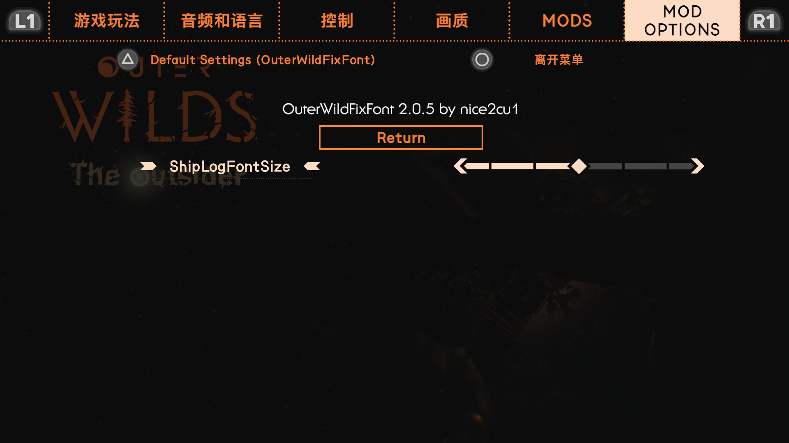

The mod fixes the problem that most of the Chinese-inclusive story mod text is incomplete by replacing the fonts of some interfaces.

It can be used to repair the Chinese translation of all stories of Outer Wilds.

This patch is to solve the problem of incomplete fonts of Outer Wilds' self-made translation in the Chinese environment.

The font of the character dialog box and the Nomai text translator have been replaced, so that the missing text can be displayed normally in the Chinese environment.

The font fragmentation caused by too much log information was fixed by modifying the font size of the spacecraft log (only exists in Chinese)

可用于Outer Wilds所有故事中文翻译的修补

这个补丁是为了解决Outer Wilds在中文环境下自制翻译的字库不全问题。

对整个游戏大部分场景（几乎所有）的字体进行了替换，使得中文环境下可以正常显示缺少的文字。

在MOD菜单中有调整飞船日志字体大小的选项。默认值为15，可以根据自己的需求调整。（过多的文字会导致字体破碎，最终的结果就是缺字，目前的解决办法就是减小字体大小）

**若在MOD菜单中未发现滑块，请尝试删除后重新安装本MOD。或者将项目里的config.json覆盖到本地mod目录的config.json。**

 

原本为[The Outsider](https://github.com/StreetlightsBehindTheTrees/Outer-Wilds-The-Outsider)没有提供翻译渠道而创立的项目。
